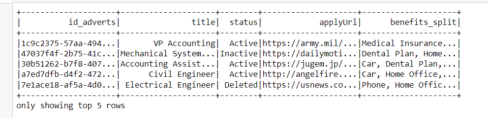

# Technical-Data-Big-Developer

# Author
Rodrigo Andrés Valle Morales

# Project Structure

<p>This project contains a <a href='Technical_Test.py'>py file</a> and a <a href='Technical_Test.ipynb'>Jupyter notebook</a> I have to mention that in the code the provided user doesn't work, so I had to work with the <a href='data-sample.json'>data sample</a> provided at the beginning. In the code I specified about how to read a parquet or json file from a S3 bucket.</p>
<p>Finally the src folder that contains all the images from results, the dimensional model and the data flow</p>

# Run in pipeline

<p>To run the <a href='Technical_Test.py'>py file</a> you can set in a terminal the next command</p>

```bash
python Technical_Test.py --Access_Key <Access key> --Secret_Key <Secret key> --Bucket <S3 Bucket> --Prefix <S3 Prefix> --Host <Host> --Port <Port> --User <User in database> --Password <User's password> --Database <Database target> 
```

# Libraries to install

-   pip install boto3
-   pip install argparse
-   pip install pyspark
-   pip install psycopg2

# Requirements

-   To have Java installed in the environment
-   To have the local variables set with HADOOP_HOME, JAVA_HOME and SPARK_HOME 

# Data profiling results 

#### Fact Table results


#### Candidate dimension results


#### Work dimension results


#### Date dimension results


#### Company dimension results


# Dataflow


### Explanation

-   The beginning of the process consists of the source database, which in this case is assumed to be a transactional database or one that the business manages.
To receive the information there are a few AWS services capable of doing so, in this case I opted in this practical example to receive the information through Database Migration Service (DMS).
-   After receiving the information through DMS, it will be ingested in a S3 Bucket in landing Zone, which we will know as the bucket where its main purpose is only to receive the information to be processed.
-   The processing Layer is in charge of applying any ETL processing of all the files that have been dropped into the Landing Zone bucket, and this through the Elastic Map Reduce (EMR) service that the main function will be to run the script that was previously specified with all the variables that are required for each situation.
-   After the data is processed in EMR, it will be sent directly to AWS Redshift, to the different tables that were specified in the dimensional model.
-   Finally, to consume the information by aby end user I proposed 3 options: 
-   -   Athena, which is a service to apply presto/SQL syntax and can be configured to connect with Redshift. 
- -   QuickSight which is a cloud-scale business intelligence service that can be used to connect to data in the cloud and combines data from many different sources. 
-   -   Finally AWS Glue which is a serverless data integration service that makes it easy for analytics users to discover, prepare, migrate and integrate data from various sources.

# Data Dictionary

The data dictionary describes the structure and data types used in the dimensional model. Below is the definition of each table and its corresponding fields:

### FACTS TABLE

| Field          | Type    | Description                         |
| -------------- | ------- | ----------------------------------- |
| id_principal   | number  | Principal ID                        |
| id_company     | number  | Company ID                          |
| id_date        | number  | Date ID                             |
| id_work        | number  | Work ID                             |
| id_candidate   | number  | Candidate ID                        |

### COMPANY DIMENSION

| Field       | Type    | Description                         |
| ----------- | ------- | ----------------------------------- |
| company     | string  | Company name                        |
| city        | string  | Company city                        |
| sector      | string  | Company sector                      |
| ID_Company  | number  | Company ID                          |

### DATE DIMENSION

| Field                | Type     | Description                         |
| -------------------- | -------- | ----------------------------------- |
| ID_Date              | number   | Date ID                             |
| activeDays           | number   | Active days                         |
| publicationDateTime  | Date     | Publication date and time           |
| _year                | number   | Publication year                    |
| _month               | number   | Publication month                   |
| _day                 | number   | Publication day                     |
| _hour                | number   | Publication hour                    |
| _minute              | number   | Publication minute                  |

### WORK DIMENSION

| Field          | Type    | Description                         |
| -------------- | ------- | ----------------------------------- |
| id_adverts     | number  | Advert ID                           |
| title          | string  | Work title                          |
| status         | string  | Work status                         |
| applyUrl       | string  | Application URL                     |
| benefits_split | string  | Work benefits                       |

### CANDIDATE DIMENSION

| Field           | Type    | Description                         |
| --------------- | ------- | ----------------------------------- |
| ID_Candidate    | number  | Candidate first name                 |
| firstName       | string  | Candidate first name                 |
| lastName        | string  | Candidate last name                  |
| age             | number  | Candidate age                        |
| skills_split    | string  | Candidate skills                     |
| applicationDate | Date    | Application date                     |


# Dimensional Model Diagram


### Explanation
-   Possibility of analyzing jobs and applications by company: Using the foreign keys `id_company` in the FACTS table and `ID_Company` in the COMPANY dimension, you can perform an analysis of the jobs and applications associated with each company . You can see the number of jobs and applications by company, make comparisons between companies and obtain metrics related to the performance and participation of companies in the job application process.

-   Analysis by date (applications per month, per day, per year): Using the foreign keys `id_date` in the FACTS table and `ID_Date` in the DATE dimension, you can perform an analysis of the applications based on of different units of time. You can get the number of apps by month, day, or year, identify patterns and trends over time, and compare performance over different periods.

-   Analysis of applications by business sector: Using the COMPANY dimension and its `company` attribute, you can perform an analysis of applications based on business sector. You can see the number of applications by industry, identify the industries with the highest share of apps, and analyze the differences between industries in terms of job applications.

-   Analysis of the distribution of applications according to age ranges: Using the CANDIDATE dimension and its `age` attribute, you can perform an analysis of applications based on age ranges. You can group applications into different age ranges, calculate descriptive statistics, identify the most common age ranges among applicants, and perform comparisons across age groups.

-   Performance on jobs (applications per job): Using the `id_work` foreign keys in the FACTS table and the WORK dimension attributes, such as `id_adverts` and `title`, you can analyze performance on different jobs . You can see the number of applications per job, identify the most popular or in-demand jobs, and perform performance comparisons between different jobs.

-   Jobs Posted by Company and Time Period: Using the `id_company` foreign keys in the FACTS table and the COMPANY dimension attributes, such as `company` and `ID_Company`, along with the dimension attributes DATE, like `_year`, `_month`, and `_day`, you can analyze jobs posted by a company in a specific time period. You can check the number of jobs posted by company and for different periods of time, make comparisons and hiring trends.
